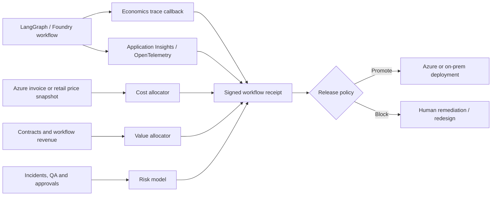

# Reference architecture

The architecture separates telemetry collection, financial attribution, risk estimation and release authority. The agent cannot edit its own economics policy or evidence receipt.

